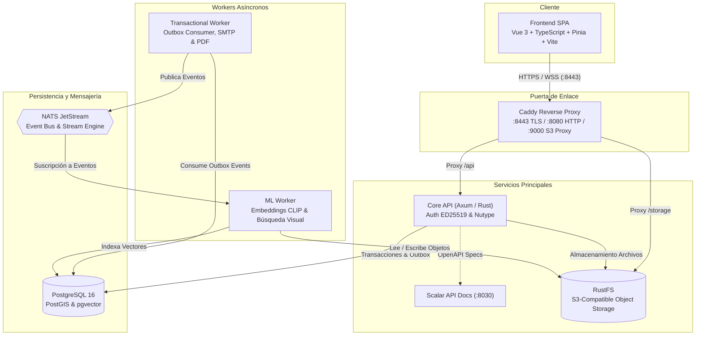

# Mercanto

Plataforma B2B de comercio mayorista diseñada para descentralizar y digitalizar la cadena de suministro en Nicaragua. Conecta a importadores y mayoristas con MIPYMES regionales, eliminando la fricción logística y la asimetría de información en el abastecimiento comercial.

---

## 📋 Descripción General

Mercanto transforma las dinámicas del comercio mayorista tradicional mediante una plataforma distribuida que ofrece:

* **Catálogo Mayorista con Precios Escalonados:** Permite a los distribuidores configurar precios por volumen, ofertas promocionales y disponibilidad de inventario en tiempo real.
* **Negociación y Cotizaciones (RFQ):** Flujo formal de solicitud de cotizaciones, contraofertas, generación automática de proformas/facturas en PDF y conversión a órdenes de compra.
* **Búsqueda Inteligente Multimodal:** Motor de búsqueda en dos etapas que combina filtros tradicionales estructurados con búsqueda semántica e inversa por imágenes impulsada por el modelo de visión **CLIP** y distancias vectoriales en **pgvector**.
* **Geolocalización Comercial y Cobertura:** Cálculo geoespacial con **PostGIS** de cobertura departamental y distancias para optimizar rutas de entrega y cálculo de fletes.
* **Billetera Digital B2B:** Sistema de libro contable (*ledger*) para gestión de saldos comerciales, transferencias entre cuentas, depósitos y retiros.
* **Mensajería en Tiempo Real:** Canales directos de chat WebSocket entre compradores y proveedores respaldados por NATS JetStream.

### 📁 Organización del Repositorio (Monorepo)

El proyecto está estructurado como un monorepo que integra dos subsistemas independientes:

* 🦀 **[Backend (`./backend`)](backend/README.md):** Sistema distribuido de alto rendimiento en Rust (Axum), arquitectura asíncrona con *Transactional Outbox*, workers de eventos (NATS JetStream), worker de Machine Learning (CLIP / pgvector), persistencia geoespacial (PostGIS) y almacenamiento S3 (RustFS).
* ⚡ **[Frontend (`./frontend`)](frontend/README.md):** Cliente web SPA en Vue 3 (Composition API), Vite, TypeScript, Tailwind CSS, Pinia para gestión de estado y mapas geoespaciales interactivos con Leaflet.

---

## 🛠️ Stack de Tecnologías

El sistema implementa tecnologías modernas seleccionadas por su confiabilidad, rendimiento y verificación estricta de tipos:

| Categoría | Tecnologías | Descripción y Rol |
| :--- | :--- | :--- |
| **Backend & Runtime** | **Rust (Edición 2021)**, **Axum 0.8**, **Tokio**, **Tower** | Framework asíncrono de alto rendimiento, concurrencia segura y tipado estricto. |
| **Bases de Datos** | **PostgreSQL 16**, **PostGIS**, **pgvector**, **SQLx** | Persistencia relacional ACID, cálculos geoespaciales y almacenamiento de embeddings vectoriales con consultas verificadas en tiempo de compilación. |
| **Streaming & Eventos** | **NATS JetStream 2.12**, **Transactional Outbox** | Bus de mensajería asíncrona de alto rendimiento, persistencia de streams y patrón outbox para entrega garantizada *at-least-once*. |
| **Inteligencia Artificial (ML)** | **CLIP (ViT-B/32)**, **Safetensors (HuggingFace)** | Generación de embeddings vectoriales (512 dimensiones) para búsqueda semántica e inversa por imagen de productos. |
| **Almacenamiento de Objetos** | **RustFS (API S3 Compatible)** | Servidor de almacenamiento de archivos estáticos (imágenes de catálogo, logotipos, comprobantes y facturas PDF). |
| **Seguridad & Criptografía** | **JWT con ED25519**, **Argon2id**, **Nutype** | Autenticación asimétrica basada en firmas criptográficas, hash seguro de contraseñas y validación exhaustiva de invariantes de dominio. |
| **Frontend Web** | **Vue 3**, **Vite**, **TypeScript**, **Tailwind CSS** | Arquitectura Single Page Application reactiva con Composition API (`<script setup>`) y tipado estricto (`vue-tsc`). |
| **Gestión de Estado & UI** | **Pinia**, **Vue Router**, **Leaflet** | Manejo de estado global reactivo, enrutamiento con guardias de navegación y visualización de mapas departamentales. |
| **Infraestructura & Gateway** | **Caddy 2.9**, **Scalar**, **Alpine Linux** | Reverse proxy con soporte TLS/HTTPS, CORS para S3, y renderizador interactivo de documentación OpenAPI 3.1. |
| **Contenedores & Automatización** | **Podman / Docker**, **Podman Compose**, **Just**, **Zellij** | Empaquetado OCI reproducible, orquestación multicontenedor, automatización de tareas y multiplexación de entorno de desarrollo. |

---

## 🏛️ Arquitectura Global del Sistema



---

## 🛠️ Requisitos Previos

* **Sistema Operativo:** Optimizado para **Linux** (ej. Fedora, Ubuntu, Arch, Debian). En Windows se recomienda **WSL2**.
* **Motor de Contenedores:** [Podman](https://podman.io/) con [Podman Compose](https://github.com/containers/podman-compose) (o Docker con Docker Compose).
* **Gestor de Tareas:** [Just](https://github.com/casey/just) (v1.14 o superior).
* **Node.js:** v18+ LTS (v20 o v22 recomendado) y `npm`.
* **Herramientas Opcionales:**
  * [Zellij](https://zellij.dev/) para el entorno de desarrollo multiventana integrado.
  * [sqlx-cli](https://crates.io/crates/sqlx-cli) (`cargo install sqlx-cli --features rustls`) para gestión directa de migraciones en el host.

---

## 🚀 Instrucciones Básicas de Instalación y Ejecución

Sigue estos pasos ordenados para inicializar, compilar y ejecutar todo el ecosistema Mercanto:

### 1. Clonar el repositorio con submódulos
```bash
git clone --recurse-submodules https://github.com/vect-maker/bytes-volcanicos-hackaton.git
cd bytes-volcanicos-hackaton
```

### 2. Configurar variables de entorno
Copia los archivos de ejemplo en backend y frontend:
```bash
cp backend/.example.env backend/.env
cp frontend/.env.example frontend/.env
```

### 3. Inicialización Automática del Proyecto
Ejecuta la receta de preparación que genera las claves criptográficas asimétricas ED25519, descarga el modelo de Machine Learning (CLIP) e instala las dependencias de Node.js:
```bash
just setup
```
*(Nota: Esto creará las claves en `backend/keys/`, descargará el modelo en `backend/data/models/clip.safetensors` e instalará los paquetes en `frontend/node_modules/`)*.

### 4. Compilación de Contenedores
Compila las imágenes OCI del backend (servidor, workers y provisionador) y la imagen del frontend:
```bash
just build
```

### 5. Inicializar Base de Datos y Aplicar Migraciones
Levanta el contenedor de PostgreSQL y aplica las migraciones del esquema relacional:
```bash
# Iniciar Postgres en segundo plano
podman compose -f backend/compose.yml up -d postgres

# Aplicar las migraciones con Just
just backend migrate
```

### 6. Cargar Datos de Demostración (Seeders)
Puebla la base de datos con la geografía de Nicaragua, categorías de productos, cuentas de prueba, organizaciones comerciales, inventario y cotizaciones:
```bash
just backend provision-all
```

---

### 7. Ejecución de la Plataforma

Puedes ejecutar la plataforma de dos formas:

#### Opción A: Entorno Integrado con Zellij (Recomendado)
Abre un espacio de trabajo completo con pestañas para Frontend, Backend, Monitoreo de recursos (`htop` + `podman stats`) y Logs en vivo:
```bash
just dev
```

#### Opción B: Ejecución Estándar por Servicios
Si prefieres terminales independientes o no utilizas Zellij:

```bash
# Terminal 1: Iniciar todos los servicios del backend
cd backend
podman compose up

# Terminal 2: Iniciar el servidor de desarrollo del frontend
cd frontend
npm run dev
# (o mediante contenedor: just frontend dev)
```

---

## 🌐 Topología de Red y Puntos de Acceso

La arquitectura separa estrictamente los servicios expuestos a la máquina anfitriona (*host*) de los servicios privados que operan de forma exclusiva dentro de la red interna de Podman/Docker (`mercanto_default`):

### 1. Puntos de Acceso Expuestos al Host (Públicos)

| Servicio | URL / Puerto | Protocolo | Descripción |
| :--- | :--- | :--- | :--- |
| **Frontend Web (Dev)** | `http://localhost:5173` | HTTP | Interfaz SPA de usuario servida por Vite con HMR |
| **Frontend Web (Prod)** | `http://localhost:3000` | HTTP | Servidor estático optimizado con Nginx Alpine |
| **API Gateway Principal (Caddy)** | `https://localhost:8443` | HTTPS / WSS | Puerta de enlace segura con TLS; enruta tráfico al backend y WebSockets |
| **API Gateway Alternativo (Caddy)** | `http://localhost:8080` | HTTP | Puerto HTTP de Caddy (proxy inverso hacia `api:8080` interno) |
| **RustFS S3 Gateway (Caddy)** | `https://localhost:9000` | HTTPS | Proxy inverso de Caddy hacia RustFS con cabeceras CORS para subida de archivos |
| **Scalar API Reference** | `http://localhost:8030` | HTTP | Interfaz interactiva de documentación OpenAPI 3.1 |
| **RustFS Console (S3 UI)** | `http://localhost:9001` | HTTP | Consola web administrativa para gestión de buckets y objetos S3 |
| **PostgreSQL 16** | `localhost:5432` | TCP | Expuesto para herramientas de administración y migraciones (`sqlx-cli`) |
| **NATS JetStream (Dev)** | `localhost:4222` | TCP | Conexiones de clientes NATS locales |
| **NATS Monitoring (Dev)** | `http://localhost:8222` | HTTP | Dashboard de métricas y streams de NATS |

### 2. Servicios Privados (Red Interna de Podman / Sin Puertos al Host)

| Servicio Interno | Hostname Interno | Rol y Comunicación en la Red |
| :--- | :--- | :--- |
| **API Core (`mercanto-server`)** | `http://api:8080` | **No expone puertos directamente al host.** Todo el tráfico externo entra a través de Caddy. |
| **Object Storage API (`rustfs`)** | `http://rustfs:9000` | API S3 nativa utilizada internamente por el servidor y los workers. Accesible desde el frontend solo a través del proxy CORS de Caddy en el puerto 9000. |
| **Transactional Worker (`worker`)** | N/A (Headless) | Procesa outbox, genera miniaturas de imágenes y despacha correos/PDF. Solo conecta a `postgres:5432`, `nats:4222` y `rustfs:9000`. |
| **ML Worker (`ml_worker`)** | N/A (Headless) | Calcula embeddings con CLIP. Se comunica exclusivamente mediante NATS y RustFS S3. |
| **Provisioner (`provisioner`)** | N/A (CLI) | Contenedor de ejecución por lotes para poblar datos iniciales vía conexión interna a `postgres:5432`. |

---

## ☁️ Despliegue en la Nube (Microsoft Azure)

La plataforma Mercanto se encuentra completamente desplegada y en funcionamiento en la nube de **Microsoft Azure**, alojando en una única máquina virtual dedicada **absolutamente todos** los componentes y servicios del ecosistema de producción, logrando una arquitectura 100% autónoma, autocontenida y libre de dependencias de servicios administrados externos de terceros (sin RDS externo, sin AWS S3 y sin Synadia NATS).

### 🖥️ Especificaciones de la Máquina Virtual (Azure VM)

| Parámetro | Detalle de Infraestructura |
| :--- | :--- |
| **Tamaño de Instancia** | **Standard B2as v2** (2 vCPUs, 8 GiB memoria RAM) |
| **Sistema Operativo** | **Linux (Ubuntu 24.04 LTS)** |
| **Región de Azure** | **North Central US** (`northcentralus`) |
| **Nombre DNS / FQDN** | `mercanto-bytes.northcentralus.cloudapp.azure.com` *(Azure Free DNS)* |
| **Dirección IP Pública** | `135.232.223.172` |
| **Dirección IP Privada** | `172.16.0.4` |
| **Red Virtual / Subnet** | `vnet-northcentralus-1` / `snet-northcentralus-1` |
| **Interfaz de Red** | `bytes-mercanto872` |
| **Grupo de Seguridad** | `bytes-mercanto-nsg` |

### 📦 Componentes Alojados en la VM (Ecosistema 100% Autónomo)

Todos los servicios y subsistemas de Mercanto se orquestan localmente en la máquina virtual mediante contenedores OCI (`compose.prod.yml`):

| Componente | Contenedor / Imagen | Tecnología | Rol en Producción |
| :--- | :--- | :--- | :--- |
| 🌐 **Frontend SPA** | `docker.io/haterofvectors/mercanto-client:prod` | Vue 3 + Vite + Tailwind + Nginx | Aplicación web interactiva para compradores, transportistas y cooperativas (servida en `/`) |
| 🦀 **Core API Backend** | `docker.io/haterofvectors/mercanto-server:prod` | Rust + Axum | Servidor HTTP RESTful, autenticación Ed25519, OpenAPI y SSE para eventos en tiempo real (servido en `/api`) |
| ⚙️ **Worker Transaccional** | `docker.io/haterofvectors/mercanto-worker:prod` | Rust | Procesamiento asíncrono en background, consumo de eventos de negocio y despacho de notificaciones |
| 🧠 **ML Worker (Visión e IA)** | `docker.io/haterofvectors/mercanto-ml-worker:prod` | Rust + Candle (CLIP ViT-B/32) | Inferencia de embeddings multimodales (texto/imagen) en CPU local para búsqueda semántica |
| 🐘 **Base de Datos** | `docker.io/garapadev/postgres-postgis-pgvector:16-stable` | PostgreSQL 16 | Almacenamiento relacional con extensiones `pgvector` (512 dims), `PostGIS` (geolocalización) y `pg_trgm` |
| 📨 **Bus de Eventos (Pub/Sub)** | `docker.io/library/nats:2.12.11-alpine3.22` | NATS JetStream | Broker de mensajería con persistencia en disco (`nats_data`) para desacoplamiento y colas de trabajo |
| 🪣 **Object Storage (S3)** | `docker.io/rustfs/rustfs:latest` | RustFS | Almacenamiento de objetos S3 local de alto rendimiento para fotos de productos, avatares y documentos |
| 📖 **Documentación API** | `scalarapi/api-reference:latest` | Scalar UI | Portal interactivo de documentación para todas las especificaciones OpenAPI/Swagger |
| 🛡️ **Reverse Proxy & TLS** | `docker.io/library/caddy:2.8-alpine` | Caddy 2 | Reverse proxy perimetral con TLS automático (Let's Encrypt / ZeroSSL), enrutador de tráfico y proxy S3 |
| 🛠️ **Provisioner (CLI)** | `docker.io/haterofvectors/mercanto-provisioner:prod` | Rust CLI | Herramienta de aprovisionamiento para seeding de datos sintéticos y creación de buckets |

### 🛡️ Reglas de Seguridad y Puertos Expuestos (Azure NSG)

La exposición de puertos hacia internet está estrictamente controlada mediante el Grupo de Seguridad de Red (**Network Security Group: `bytes-mercanto-nsg`**). Solo se permiten conexiones a los servicios perimetrales esenciales; la base de datos, el bus de eventos NATS y la API interna se mantienen aislados en la red interna de contenedores:

| Prioridad | Nombre de Regla | Puerto | Protocolo | Origen / Destino | Acción | Rol / Servicio Asociado |
| :---: | :--- | :---: | :---: | :---: | :---: | :--- |
| **300** | `SSH` | `22` | TCP | Any / Any | ✅ Allow | Acceso administrativo remoto seguro a la máquina virtual |
| **310** | `http` | `80` | TCP | Any / Any | ✅ Allow | Caddy Reverse Proxy (redirección automática HTTP ➔ HTTPS) |
| **320** | `https` | `443` | TCP | Any / Any | ✅ Allow | Caddy Reverse Proxy TLS: sirve la aplicación **Frontend SPA** en `/` y la **Core API** en `/api/*` |
| **330** | `rustfs` | `9000` | Any (TCP) | Any / Any | ✅ Allow | Proxy Caddy hacia **RustFS S3 Gateway** (Object Storage con cabeceras CORS) |


### Configuración del Entorno y Aprovisionamiento en la VM

1. **Gestor de Contenedores y Orquestación:**
   - **Podman + Docker Compose:** La VM utiliza Podman en modo rootless junto al plugin oficial `/usr/local/bin/docker-compose` para el despliegue del stack `compose.prod.yml`.
   - **Just:** Instalado como runner de comandos para ejecutar migraciones (`just backend migrate`), seeding (`just backend provision-all`) y despliegue continuo (`just backend deploy-prod`).

2. **Instalación de `sqlx-cli` para Gestión de Migraciones:**
   - Se requirió e instaló la herramienta CLI oficial **`sqlx-cli` (v^0.9)** directamente en el host de la máquina virtual (mediante `cargo install sqlx-cli --no-default-features --features rustls,postgres` o `just install-sqlx-cli`).
   - **Propósito:** Ejecutar las migraciones estructuradas en `backend/migrations/` de manera versionada, atómica y segura contra PostgreSQL mediante `just backend migrate`. Esto reemplaza esquemas frágiles de scripts en `/docker-entrypoint-initdb.d/` y garantiza la inicialización correcta de extensiones (`vector`, `postgis`, `pg_trgm`), esquemas de seguridad y tablas.

3. **Memoria de Intercambio (Swap de 4 GB):**
   - Se configuró una partición/archivo de intercambio Swap de 4 GB (`/swapfile`) persistido en `/etc/fstab`.
   - **Propósito:** Proporcionar margen de memoria suficiente para descargar los artefactos del modelo y soportar la inferencia en RAM del modelo de visión multimodal **CLIP (ViT-B/32)** (`clip.safetensors`, ~350 MB en disco) y la indexación de similitud vectorial en **pgvector** sin riesgo de que los procesos sean interrumpidos por el OOM Killer del kernel.

4. **Arquitectura de Enrutamiento Inverso (Caddy):**
   - **Gestión Automática de TLS:** Caddy obtiene y renueva certificados HTTPS válidos para `mercanto-bytes.northcentralus.cloudapp.azure.com`.
   - **Enrutamiento Unificado:**
     - `https://mercanto-bytes.northcentralus.cloudapp.azure.com/` ➔ Servido por el contenedor **Frontend SPA** (`mercanto-client:prod` en Nginx).
     - `https://mercanto-bytes.northcentralus.cloudapp.azure.com/api/*` ➔ Reenviado al **Backend Axum** (`mercanto-server:prod`), removiendo el prefijo `/api`.
     - `https://mercanto-bytes.northcentralus.cloudapp.azure.com/notifications*` ➔ Canal persistente de eventos SSE para notificaciones en vivo.
     - `https://mercanto-bytes.northcentralus.cloudapp.azure.com:9000` ➔ Proxy S3 con cabeceras CORS para subida directa de imágenes y documentos a RustFS.

### 🌐 Puntos de Acceso Públicos en Producción

* 🌐 **Plataforma Web (Frontend):** [https://mercanto-bytes.northcentralus.cloudapp.azure.com](https://mercanto-bytes.northcentralus.cloudapp.azure.com)
* 🦀 **API REST Backend:** [https://mercanto-bytes.northcentralus.cloudapp.azure.com/api](https://mercanto-bytes.northcentralus.cloudapp.azure.com/api)
* 🪣 **Almacenamiento S3 (RustFS):** [https://mercanto-bytes.northcentralus.cloudapp.azure.com:9000](https://mercanto-bytes.northcentralus.cloudapp.azure.com:9000)
* 🩺 **Health Check:** [https://mercanto-bytes.northcentralus.cloudapp.azure.com/health](https://mercanto-bytes.northcentralus.cloudapp.azure.com/health)

---

## 🧭 Catálogo de Recetas `just`

El `justfile` raíz centraliza las operaciones del monorepo mediante el soporte de módulos:

| Comando | Descripción |
| :--- | :--- |
| `just setup` | Genera claves ED25519, descarga el modelo CLIP e instala dependencias de frontend. |
| `just build` | Compila las imágenes OCI de depuración del backend y la imagen del frontend. |
| `just check` | Ejecuta la verificación estática de tipos en el frontend (`vue-tsc`). |
| `just dev` | Inicia el entorno de desarrollo multiventana integrado en Zellij. |
| `just backend <receta>` | Ejecuta directamente cualquier tarea del backend (ej. `just backend migrate`, `just backend provision-all`). |
| `just frontend <receta>` | Ejecuta directamente cualquier tarea del frontend (ej. `just frontend dev`, `just frontend build-image`). |

Para consultar la documentación específica de cada subsistema:
* 📖 [Documentación Técnica del Backend](backend/README.md)
* 📖 [Documentación Técnica del Frontend](frontend/README.md)
* 🏛️ [Arquitectura Detallada del Sistema](backend/docs/arquitectura.md)
