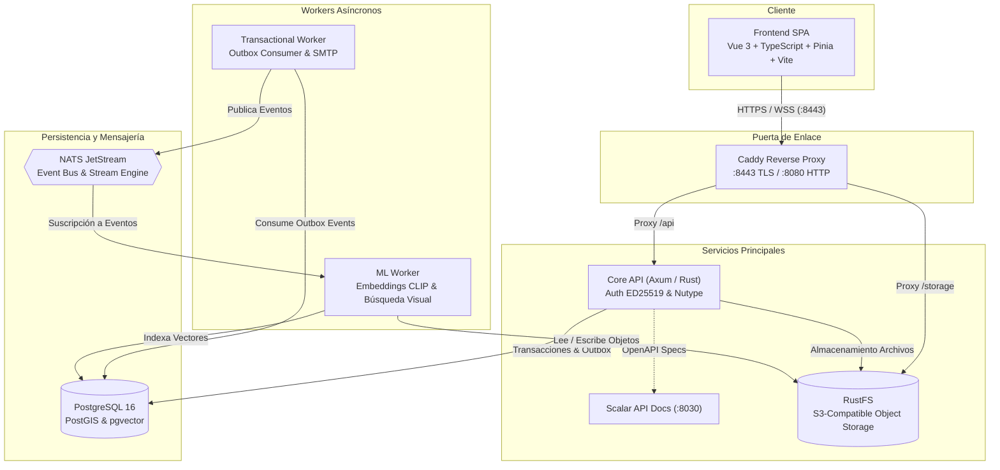

# Mercanto

Plataforma B2B de comercio mayorista diseñada para descentralizar y digitalizar la cadena de suministro en Nicaragua. Conecta a importadores y mayoristas con MIPYMES regionales, eliminando la fricción logística y la asimetría de información en el abastecimiento comercial.

---

## 📁 Submódulos del Repositorio

El proyecto está organizado como un repositorio paraguas que integra dos subsistemas independientes:

* 🦀 **[Backend (`./backend`)](backend/README.md)**: API de alto rendimiento en Rust (Axum), arquitectura asíncrona con *Transactional Outbox*, workers de eventos (NATS JetStream), worker de Machine Learning (CLIP / pgvector), persistencia geoespacial (PostGIS) y almacenamiento S3 (RustFS).
* ⚡ **[Frontend (`./frontend`)](frontend/README.md)**: Cliente SPA desarrollado en Vue 3 (Composition API), Vite, TypeScript, Tailwind CSS, Pinia para gestión de estado, y mapas geoespaciales con Leaflet.

---

## 🏛️ Arquitectura Global del Sistema

El ecosistema de Mercanto está diseñado bajo principios de **escalabilidad horizontal**, **consistencia transaccional** y **verificación estricta en tiempo de compilación**:



### Características Clave
* **Búsqueda Multimodal Inteligente:** Indexación semántica y búsqueda por imágenes utilizando vectores generados por el modelo de ML (CLIP) y almacenados en `pgvector`.
* **Geolocalización Comercial:** Cálculo de cobertura de entrega, rutas y proximidad de proveedores mediante `PostGIS`.
* **Transactional Outbox:** Garantía de entrega atómica de eventos en base de datos antes de publicarlos en NATS JetStream, protegiendo la resiliencia del sistema ante caídas.
* **Seguridad Criptográfica:** Firma de tokens de acceso mediante pares de claves asimétricas ED25519 y hash de contraseñas con Argon2.

---

## 🛠️ Requisitos Previos

* **Sistema Operativo:** Diseñado y optimizado para **Linux** (ej. Fedora, Ubuntu, Arch). En Windows, se recomienda el uso estricto de **WSL2**.
* **Contenedores:** [Podman](https://podman.io/) y [Podman Compose](https://github.com/containers/podman-compose) (o Docker / Docker Compose).
* **Gestor de Tareas:** [Just](https://github.com/casey/just) (versión 1.14 o superior).
* **Entorno Frontend:** [Node.js](https://nodejs.org/) (v18+ LTS) y `npm`.
* **Multiplexor de Terminal (Opcional):** [Zellij](https://zellij.dev/) para el entorno de desarrollo automatizado.

---

## 🚀 Inicio Rápido (Monorepo)

### 1. Clonar el repositorio con sus submódulos
```bash
git clone --recurse-submodules https://github.com/vect-maker/bytes-volcanicos-hackaton.git
cd bytes-volcanicos-hackaton
```

### 2. Configurar variables de entorno
Copia las plantillas correspondientes para cada subproyecto:
```bash
cp backend/.example.env backend/.env
cp frontend/.env.example frontend/.env
```

### 3. Inicialización Automática
Utiliza el `justfile` raíz para preparar dependencias de frontend y generar las llaves criptográficas del backend:
```bash
just setup
```

### 4. Compilación
Compila las imágenes de desarrollo del backend y construye los paquetes del frontend:
```bash
just build
```

### 5. Entorno de Desarrollo Integrado
Inicia la sesión de desarrollo en Zellij, la cual levantará automáticamente pestañas para Frontend, Backend, Monitoreo de recursos (`htop` + `podman stats`) y Logs en vivo:
```bash
just dev
```

---

## 🧭 Recetas del Gestor de Tareas (`just`)

El `justfile` raíz expone los comandos generales y conecta con los submódulos usando soporte nativo de módulos:

| Comando | Descripción |
| :--- | :--- |
| `just setup` | Genera claves ED25519 en backend e instala dependencias `npm` en frontend. |
| `just build` | Compila las imágenes OCI de depuración del backend y compila el frontend. |
| `just check` | Ejecuta el análisis de tipos estáticos (`vue-tsc`) en el frontend. |
| `just dev` | Lanza el entorno de desarrollo multiventana en Zellij. |
| `just backend <receta>` | Ejecuta directamente cualquier receta del backend (ej. `just backend download-model`). |
| `just frontend <receta>` | Ejecuta directamente cualquier receta del frontend (ej. `just frontend dev`). |

Para explorar la documentación detallada de cada subsistema:
- Consulta la [Documentación del Backend](backend/README.md).
- Consulta la [Documentación del Frontend](frontend/README.md).
